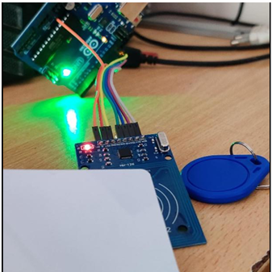
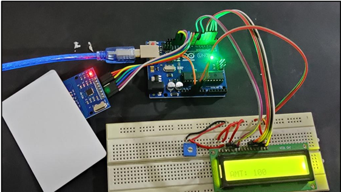
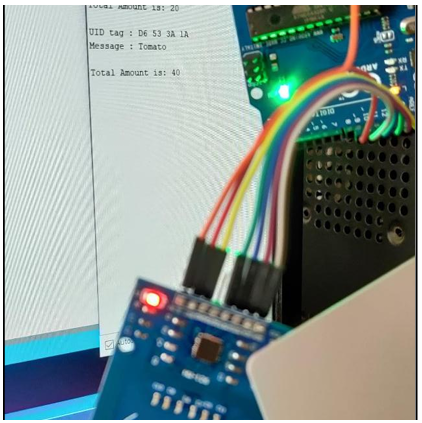

# 🛒 Basket Scanner – IoT Smart Billing System

An IoT-enabled smart shopping basket that scans items in real time to automate billing, reduce queues, and provide a checkout-free retail experience.

## 🔧 Features

- Real-time product scanning using **RFID**
- Automatic billing display on **LCD**
- Wireless data transfer to central billing system
- Alerts for purchase limit threshold
- Easy-to-use embedded design for customers

## 🚀 Tech Stack

- **Microcontroller:** Arduino Uno
- **Language:** Embedded C
- **Sensors & Modules:** RFID Reader, RFID Tags, NodeMCU (ESP8266), Bluetooth Module
- **Display:** LCD 16x2
- **Other Hardware:** Power supply, reset/crystal circuit, resistors, LEDs

## 📷 Images

| RFID Scanning | Output on LCD | Output on Computer |
|---------------|---------------|---------------------|
|  |  |  |

## ⚙️ System Architecture

- Items are tagged with RFID cards
- As items are added/removed from the basket, RFID data is processed by Arduino
- Billing total is updated and shown on LCD
- All data is sent via wireless module to backend billing software

## 🏆 Outcomes

- ✅ Reduced billing time by automating checkout
- ✅ Improved shopping experience and eliminated queueing
- ✅ Successfully simulated end-to-end retail billing flow

## 📁 Folder Structure

<pre>
basket-scanner/
├── Code/
│   └── basket_scanner.ino
├── Documents/
│   ├── PROJECT REPORT.pdf
│   └── Index project.pdf
├── Presentations/
│   └── Basket Scanner ppt.pptx
├── images/
│   ├── lcd-output.png
│   ├── rfid-scan.png
│   ├── computer-output.png
│   └── ..............
└── README.md 
</pre>

## 🧠 Skills Demonstrated

- Embedded C & Arduino Programming
- IoT Sensor Integration
- Circuit Design & Hardware Assembly
- Wireless Communication (Wi-Fi, Bluetooth)
- Real-time Data Display & Billing

## License

This project is licensed under the MIT License - see the [LICENSE](LICENSE) file for details.

## 📚 References

- [Arduino Official Docs](https://www.arduino.cc/)
- [RFID with Arduino Tutorial](https://circuitdigest.com/microcontroller-projects/rfid-interfacing-with-arduino)
- [ESP8266 Documentation](https://www.espressif.com/en/products/socs/esp8266)

---

**Note:** 👨‍💻 Developed as part of **final-year** in **Diploma Engineering** in **Computer Engineering** project in **May 2020** at **Mahavir Swami College of Polytechnic.**
